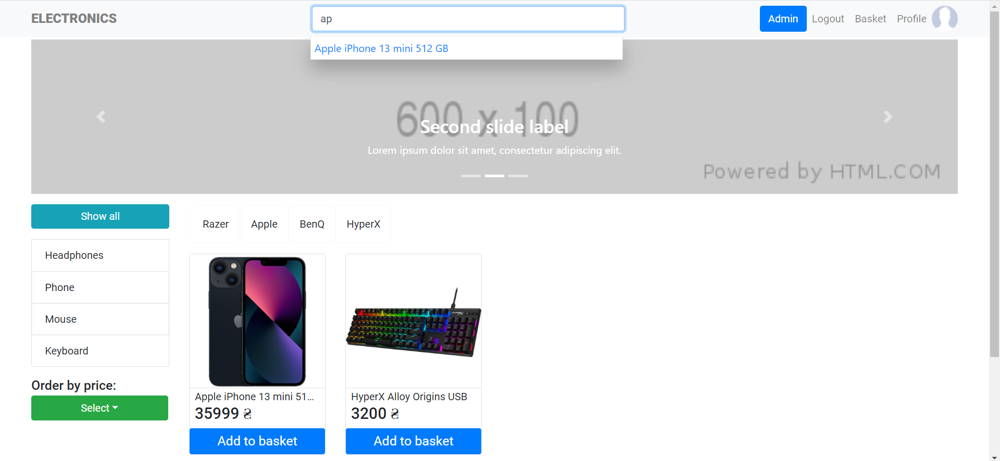
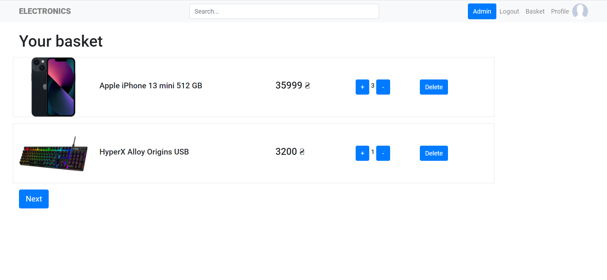
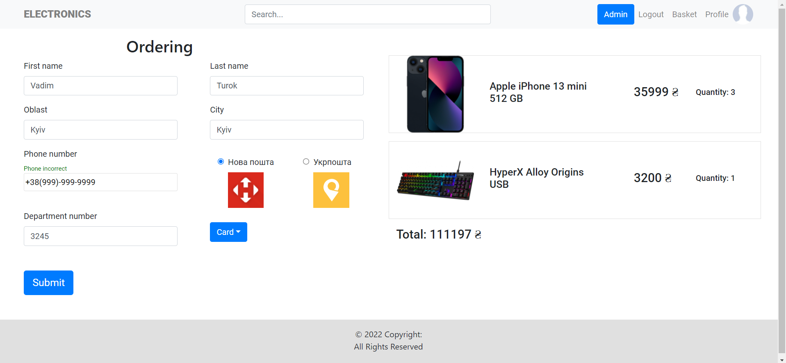
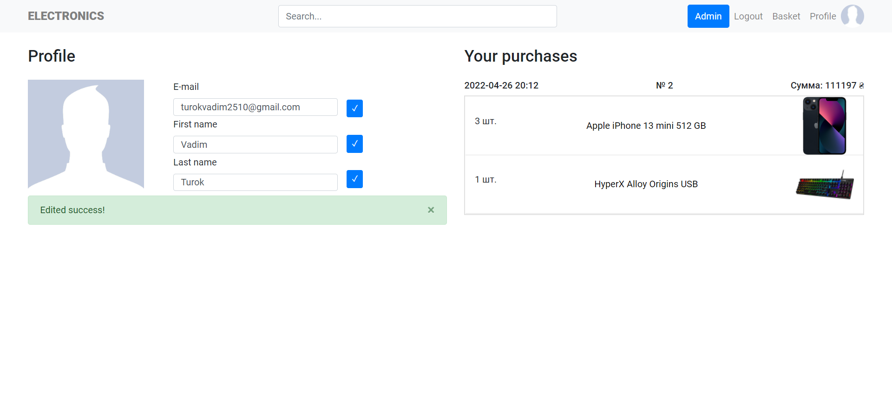

# 💳Electronics - e-comemrce project
> Electronics is the internet-shop of electronic devices such as phones, keyborad and so on...
> Full of functionality as it should be in such a project. You can see images below.


## Table of Contents
* [Technologies Used](#technologies-used)
* [Features](#features)
* [Screenshots](#screenshots)
* [Setup](#setup)
* [Project Status](#project-status)
* [Acknowledgements](#acknowledgements)
* [Contact](#contact)
<!-- * [License](#license) -->


## Technologies Used
- React - version 18.0.0
- React-bootstrap - version 1.4.3
- Styled components - version 5.2.1
- Moment - version 2.29.1
- MobX - version 6.1.5
- Moment - version 2.29.3
- Axios - version 0.26.1
- Express - version 4.17.1 
- JWT - version 8.5.1
- PostgreSQL(pg) - version 8.5.1
- SequelizeORM - version 6.5.0


## Features
Main features of the app:
#### Administrator:
- Create types
- Create brands
- Create devices
- Delete devices
- Delete comments
#### User:
- Filter products by type, brand, select all
- Order products by price: in ascending or descending
- Add products to basket
- Delete products from basket
- Place orders
- View own orders
- Edit user info
- Create comment to product
- Search products by name, type or brand
#### General:
- Form validation
- Authorization & authentication system using JWT
- Good UI


## Screenshots




<!-- If you have screenshots you'd like to share, include them here. -->


## Setup
For back-end: create .env file and provide DB credentianls

Run following commands:

```
npm install
npm run dev
```
To run React application: open 'client' folder

Run following commands:

```
npm install
npm start
```


## Project Status
Project is: _completed_


## Acknowledgements
This project was taken as a core by UlbiTV tutorial on YT - https://www.youtube.com/watch?v=H2GCkRF9eko
Big thanks to him!


## Contact
Contact with me via e-mail: turokvadim2510@gmail.com or on Twitter: [Vadim Turok](https://twitter.com/stefanio228)


<!-- Optional -->
<!-- ## License -->
<!-- This project is open source and available under the [... License](). -->

